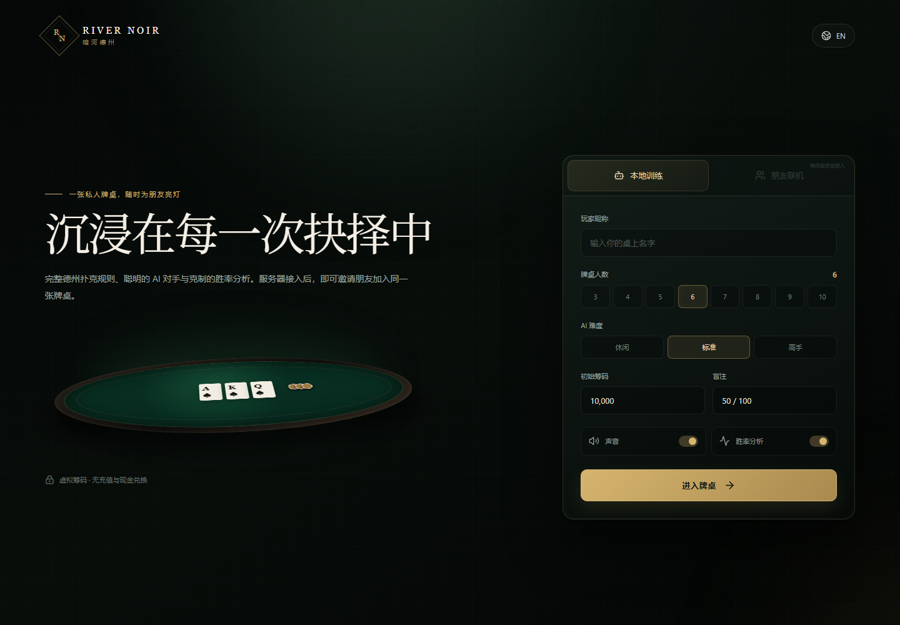
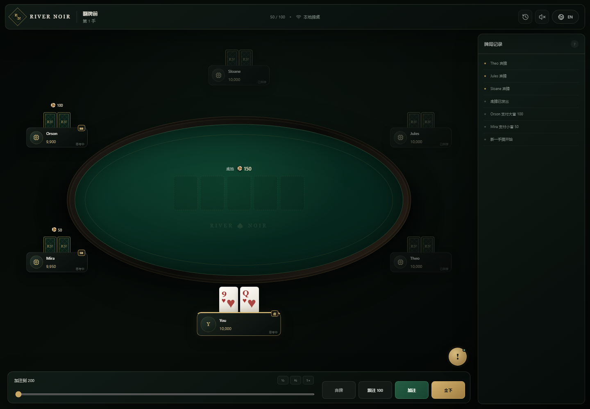

# River Noir／暗河德州

一款高级感、双语、服务器就绪的德州扑克网页游戏。当前版本可以在浏览器中完整进行本地人机对局；配置 WebSocket 服务地址后，大厅会自动开放朋友联机入口。





## 功能

- 3～10 人本地训练，空余座位由 AI 补足。
- 完整 No-Limit Texas Hold’em 牌局流程。
- Fold、Check、Call、Bet、Raise 和 All-in。
- Heads-up 规则、最小加注、短码 All-in、未跟注筹码退回。
- 主池、多层边池、平分底池和零散筹码分配。
- 休闲、标准、高手三档 AI。
- Monte Carlo 多人胜率、牌力、听牌和补牌分析。
- 胜率计算运行于 Web Worker。
- 简体中文与英文即时切换。
- 桌面与移动端响应式牌桌。
- 发牌、行动、结算动效和轻量音效。
- 牌局日志、快捷下注和加注滑杆。
- LocalTransport 与 WebSocketTransport 统一通信边界。
- 玩家视角快照，隐藏其他玩家私人底牌。
- GitHub Pages 自动部署工作流。

项目只使用虚拟筹码，不提供充值、提现、兑换或现金结算能力。

## 快速开始

环境要求：

- Node.js 22 或更新的 LTS 版本。
- npm 11 或兼容版本。

安装并启动：

```bash
npm install
npm run dev
```

生产验证：

```bash
npm run verify
```

静态产物位于 `apps/web/dist`。

## 接入 DeepSeek 对手

将根目录的 `.env.example` 复制到 `apps/web/.env.local`，填写 DeepSeek API Key：

```powershell
Copy-Item .env.example apps/web/.env.local
```

```text
DEEPSEEK_API_KEY=你的_API_Key
DEEPSEEK_BASE_URL=https://api.deepseek.com
DEEPSEEK_MODEL=deepseek-v4-flash
```

运行 `npm run dev` 后，可以在单机牌桌设置中选择“本地 AI”或“DeepSeek”。选择 DeepSeek 后，全部 AI 对手都会由 DeepSeek 驱动。每个座位拥有独立姓名、性格与打法，只能看到自己的底牌和公开牌局信息。模型请求失败或动作不合法时，仅在对应角色的当前回合采用本地策略。

API Key 只由 Vite 开发与预览代理读取。部署静态产物时，需要在服务端实现同等的 `/api/deepseek` 反向代理，禁止将 API Key 放入任何 `VITE_` 环境变量。

Vercel 部署已内置 `/api/deepseek/chat/completions` Serverless 代理。请在 Vercel 项目环境变量中配置 `DEEPSEEK_API_KEY`、`DEEPSEEK_BASE_URL` 和 `DEEPSEEK_MODEL`，其中 API Key 只设置在服务端环境。

## 接入朋友联机

将根目录的 `.env.example` 复制到 `apps/web/.env.local`：

```powershell
Copy-Item .env.example apps/web/.env.local
```

```text
VITE_WS_URL=wss://your-domain.example/ws
```

启动或重新构建后，“朋友联机”入口会自动启用。服务器需要实现 `docs/WEBSOCKET_PROTOCOL.md` 中的消息协议。

主要交接资料：

- [产品与技术规范](./docs/PRODUCT_SPEC.md)
- [WebSocket 协议](./docs/WEBSOCKET_PROTOCOL.md)
- [服务器接入指南](./docs/SERVER_INTEGRATION.md)
- [锦标赛规则基线](./docs/TOURNAMENT_RULES.md)
- [构建与部署](./docs/DEPLOYMENT.md)
- [长期开发日志](./DEVELOPMENT_LOG.md)

## 架构

```text
React UI
  ↓
Zustand Player View Store
  ↓
GameTransport
  ├─ LocalGameTransport → AI → Shared Poker Engine
  └─ WebSocketGameTransport → Remote Authoritative Server
```

工作区：

```text
apps/web                 React、牌桌、Worker、通信适配器
packages/poker-engine    牌组、牌型、下注、边池和结算
packages/poker-equity    Monte Carlo 胜率与牌力分析
packages/poker-ai        三档 AI 策略
packages/protocol        联机消息、玩家视角和传输接口
docs                     产品、协议、接入和部署文档
```

## 常用命令

```bash
npm run dev
npm run lint
npm run typecheck
npm run test
npm run build
npm run verify
```

## 安全边界

本地训练模式的完整牌局在浏览器中运行。朋友联机时，服务器必须成为洗牌、发牌、行动、计时和结算的权威来源。客户端仅提交操作意图，并根据服务端返回的玩家专属快照显示牌局。

浏览器环境变量中的 `VITE_` 前缀值会进入公开构建产物，不得存放 API 密钥、房间密码或服务器秘密。

## 许可证

仓库暂未附加开源许可证。公开发布前请由项目所有者选择合适的授权方式。
